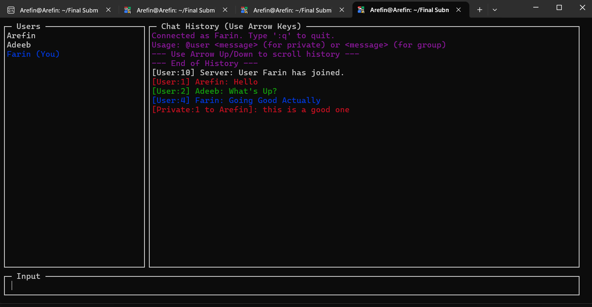
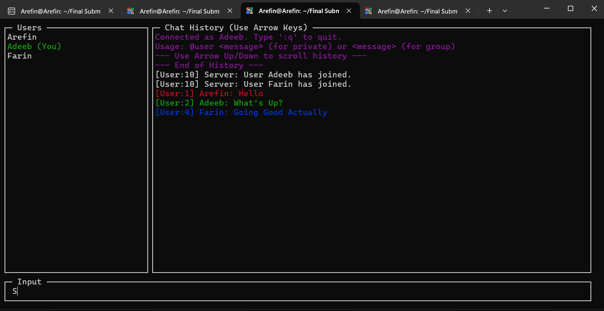
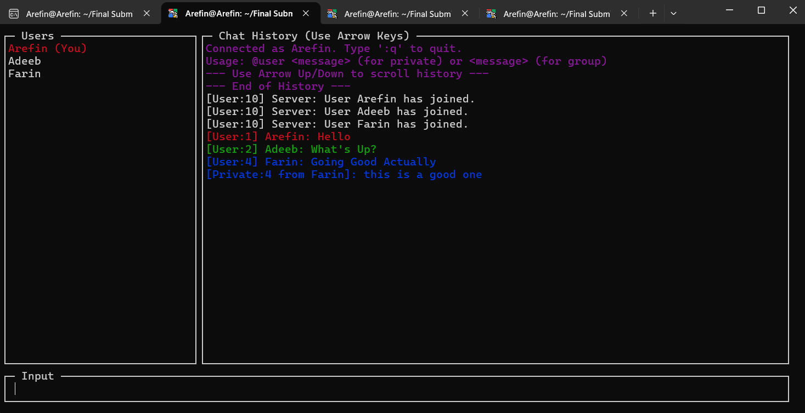
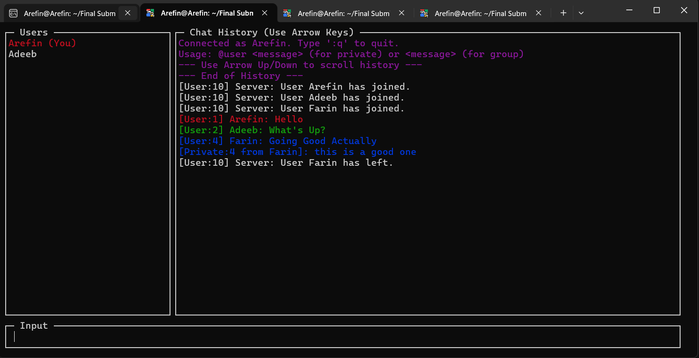

# 💬 Terminal-Based Concurrent Chat System (C)

A high-performance, multi-threaded chat application developed in C. This project features a sophisticated `ncurses` terminal UI, robust socket communication, and thread synchronization to handle multiple concurrent users.

## 📸 Project Screenshots

  
   

  
  

## ✨ Core Features
* **Ncurses TUI:** Three-panel layout (User List, Chat Logs, Input Field) with real-time scrolling and color support.
* **Concurrency:** Implements a **Thread-per-Client** model using `pthreads`.
* **Socket Programming:** Uses TCP/IP (`SOCK_STREAM`) for reliable data delivery.
* **Privacy Controls:** Supports global broadcasts and private messaging via `@username`.
* **Smart History:** Server logs chat history but filters private messages so only intended recipients see them.
* **Auto-Shutdown:** Server detects idle states and shuts down gracefully when the last user leaves.

## 🛠️ Technical Details
* **Language:** C99
* **Threading:** `pthread_mutex_t` used to prevent race conditions during client list updates and log writing.
* **Networking:** Wrapped `FILE*` streams over sockets for stable, line-buffered communication.
* **Build Tool:** Makefile included for easy compilation.

## 🤖 AI Assistance & Transparency
This project was developed as a "Pair Programming" exercise with significant assistance from AI (Gemini). 

**My Role (Lead Developer):**
* **Architecture Design:** Defined the requirements for the three-panel layout and the logic for private messaging.
* **Project Management:** Structured the multi-file project, managed the `Makefile`, and handled the compilation/debugging process in a Linux environment.
* **Integration:** Manually resolved threading conflicts and ensured `ncurses` worked harmoniously with the networking backend.

**AI's Role (Co-Pilot):**
* **Implementation:** Assisted in generating roughly 95% of the codebase, specifically the low-level socket handling and the complex `ncurses` pad scrolling logic.
* **Problem Solving:** Used to explore advanced C concepts such as mutex locking and stream duplication (`dup()`).

## 🚀 How to Run
1. Clone the repo: `git clone https://github.com/shamsularefin707/C-Terminal-Chat-App.git`
2. Compile: `make`
3. Start Server: `./server`
4. Start Client: `./client`

## 🎓 Academic Context
Developed as a Lab Final Project of 1-1 for BSSE (Roll 1732). This project served as a practical deep-dive into Operating Systems (Concurrency) and Networking fundamentals before my formal academic coursework.

---
**Author:** Md. Shamsul Arefin (shamsularefin707)
